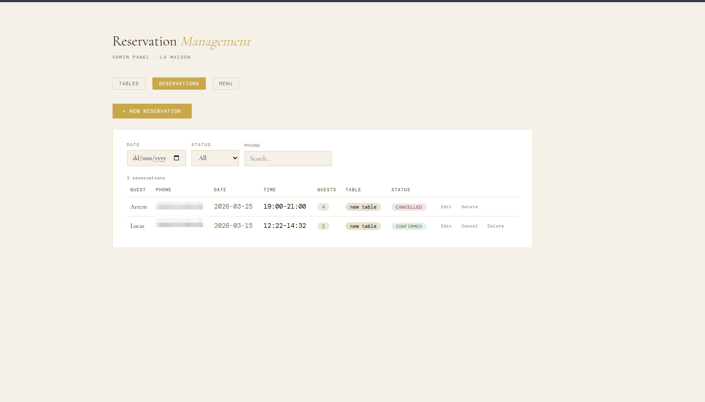
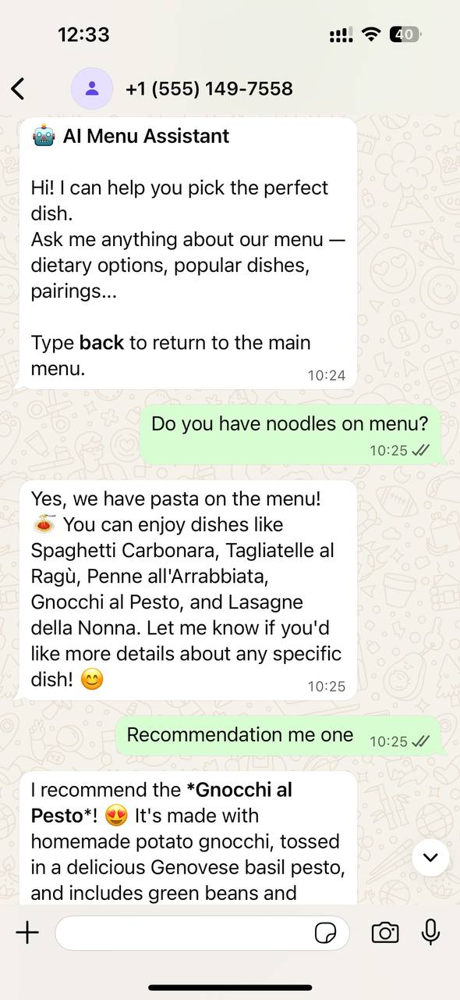

# 🤖 WhatsApp Restaurant Chatbot

A production-ready WhatsApp chatbot for restaurant businesses — built with **FastAPI**, **Redis**, **PostgreSQL**, and **OpenAI**. Handles menu browsing, table reservations, restaurant info, and AI-powered dish suggestions, all through interactive WhatsApp menus.


---

## ✨ Features

- **Interactive WhatsApp menus** — list menus and button replies via Meta Cloud API
- **State machine architecture** — Redis-backed sessions keyed by phone number
- **Menu browsing** — explore dishes by category
- **Table reservations** — multi-step guest detail collection
- **Restaurant info** — hours, location, contact
- **AI-powered suggestions** — Upload menu it will be used for context of ai suggestions
- **Admin panel** — Next.js frontend for managing tables, reservations, and menu documents
- **Admin WhatsApp mode** — admins reply to customers via WhatsApp using phone-prefix format
---

## 🖥 Admin Panel

A Next.js frontend at `http://localhost:3000` gives restaurant staff full control over tables, reservations, and menu documents.



---

## 📱 App Demo (WhatsApp)



### Table Management
Add, edit, and remove tables with name, seat count, and active/inactive status.


### Reservation Management
View all reservations with filters by date, status, and phone number. Confirm, cancel, edit, or delete individual reservations.


### Menu Management
Upload menu PDFs that get parsed and indexed for AI-powered dish suggestions via RAG.


---

## 🏗 Architecture

Hybrid design: deterministic state machine for navigation and transactional flows, AI for open-ended dish recommendations.


## 🚀 Getting Started


### 1. Clone the repo

```bash
git clone https://github.com/Reverlight/whatsapp-chatbot
cd whatsapp-chatbot
```

### 2. Configure environment

Create a `.env` file in the project root:

```env
# WhatsApp / Meta
WHATSAPP_TOKEN=your_meta_cloud_api_access_token
PHONE_NUMBER_ID=your_whatsapp_business_phone_number_id
VERIFY_TOKEN=your_webhook_verify_token
APP_SECRET=your_meta_app_secret

# OpenAI
OPENAI_API_KEY=sk-...

# Database
DATABASE_URL=postgresql+asyncpg://postgres:password@db:5432/chatbot
REDIS_URL=redis://redis:6379

# Admin phones (comma-separated, with or without +)
ADMIN_PHONES=380991234567,380671234567

# PgAdmin
PGADMIN_DEFAULT_EMAIL=admin@admin.com
PGADMIN_DEFAULT_PASSWORD=admin
```

### 3. Start the stack

```bash
make start-dev
```

| Service       | URL                          | Notes            |
|---------------|------------------------------|------------------|
| FastAPI        | http://localhost:8000        | Webhook receiver |
| Swagger UI     | http://localhost:8000/docs   | API docs         |
| Frontend       | http://localhost:3000        | Admin panel      |
| PgAdmin        | http://localhost:8090        | Database UI      |
| Redis          | localhost:6379               | Session store    |

### 4. Run database migrations

```bash
docker compose run web alembic upgrade head
```

### 6. Run tests

```bash
make start-test
```

---

## 🤖 Admin Mode

Admins are identified by phone number via `ADMIN_PHONES`. To reply to a customer, send a WhatsApp message in the format:

```
380667654321 Your table is ready!
```

This forwards the message to the customer's WhatsApp. Any message without a phone prefix routes the admin through the normal user state machine.

---


## 📋 Makefile Commands

| Command           | Description                        |
|-------------------|------------------------------------|
| `make start-dev`  | Start full stack in development mode |
| `make start-test` | Run test suite in Docker           |
| `make start-prod` | Start stack in production mode     |

---
